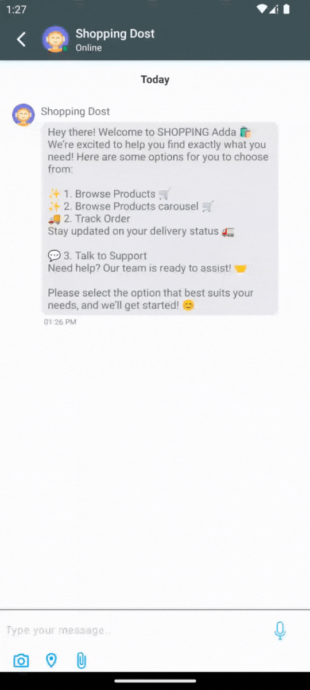

# Kommunicate Flutter plugin

Flutter wrapper using the native modules of Kommunicate Android and iOS SDKs.
Refer to the official docs here: https://docs.kommunicate.io/docs/flutter-installation.html




## Installation

1. Add the below dependency in your pubspec.yaml file:

```
dependencies:
  //other dependencies
  kommunicate_flutter: ^2.0.9
```

2. Install the package as below:

```
flutter pub get
```

3. Import the kommunicate_flutter in your .dart file to use the methods from Kommunicate:

```
import 'package:kommunicate_flutter/kommunicate_flutter.dart';
```

4. For iOS, navigate to YourApp/ios directory from terminal and run the below command:

```
pod install
```

> Note: Kommunicate iOS requires min ios platform version 13 and uses dynamic frameworks. Make sure you have the below settings at the top of your ios/Podfile:

```
 platform :ios, '13.0'
 use_frameworks!
```

## Get your Application Id

Sign up for [Kommunicate](https://dashboard.kommunicate.io) to get your [APP_ID](https://dashboard.kommunicate.io/settings/install). This APP_ID is used to create/launch conversations.

## Launch chat

Kommunicate provides buildConversation function to create and launch chat directly saving you the extra steps of authentication, creation, initialization and launch. You can customize the process by building the conversationObject according to your requirements.
To launch the chat you need to create a conversation object. This object is passed to the `buildConversation` function and based on the parameters of the object the chat is created/launched.

Below are some examples to launch chat in different scenarios:

### Launching chat for visitor:

If you would like to launch the chat directly without the visiting user entering any details, then use the method as below:

```dart
try {
     dynamic conversationObject = {
         'appId': '<APP_ID>' // The [APP_ID](https://dashboard.kommunicate.io/settings/install) obtained from kommunicate dashboard.
     };
      dynamic result = await KommunicateFlutterPlugin.buildConversation(conversationObject);
      print("Conversation builder success : " + result.toString());
    } on Exception catch (e) {
      print("Conversation builder error occurred : " + e.toString());
    }
```

### Launching chat for visitor with lead collection:

If you need the user to fill in details like phone number, emailId and name before starting the support chat then launch the chat with `withPreChat` flag as true. In this case you wouldn't need to pass the kmUser. A screen would open up for the user asking for details like emailId, phone number and name. Once the user fills the valid details (atleast emailId or phone number is required), the chat would be launched. Use the function as below:

```dart
try {
     dynamic conversationObject = {
         'appId': '<APP_ID>',// The [APP_ID](https://dashboard.kommunicate.io/settings/install) obtained from kommunicate dashboard.
         'withPreChat': true
      };
      dynamic result = await KommunicateFlutterPlugin.buildConversation(conversationObject);
      print("Conversation builder success : " + result.toString());
    } on Exception catch (e) {
      print("Conversation builder error occurred : " + e.toString());
    }
```

### Launching chat with existing user:

If you already have the user details then create a KMUser object using the details and launch the chat. Use the method as below to create KMUser with already existing details:

```dart
try {
     dynamic user = {
       'userId' : '<USER_ID>',   //Replace it with the userId of the logged in user
       'password' : '<PASSWORD>'  //Put password here if user has password, ignore otherwise
     };
     dynamic conversationObject = {
         'appId': '<APP_ID>',// The [APP_ID](https://dashboard.kommunicate.io/settings/install) obtained from kommunicate dashboard.
         'kmUser': jsonEncode(user)
      };
      dynamic result = await KommunicateFlutterPlugin.buildConversation(conversationObject);
      print("Conversation builder success : " + result.toString());
    } on Exception catch (e) {
      print("Conversation builder error occurred : " + e.toString());
    }
```

> Note: `jsonEncode` requires the dart package `dart:convert`. Make sure you have imported the package at the top of the dart file as `import 'dart:convert';`

If you have a different use-case and would like to customize the chat creation, user creation and chat launch, you can use more parameters in the conversationObject.

Below are all the parameters you can use to customize the conversation according to your requirements:

| Parameter            |     Type     | Description                                                                                                                                                                                                                                                                                                                                                                                                                                                                                                                                   |
| -------------------- | :----------: | :-------------------------------------------------------------------------------------------------------------------------------------------------------------------------------------------------------------------------------------------------------------------------------------------------------------------------------------------------------------------------------------------------------------------------------------------------------------------------------------------------------------------------------------------- |
| appId                |    String    | The [APP_ID](https://dashboard.kommunicate.io/settings/install) obtained from kommunicate dashboard                                                                                                                                                                                                                                                                                                                                                                                                                                           |
| groupName            |    String    | Optional, you can pass a group name or ignore                                                                                                                                                                                                                                                                                                                                                                                                                                                                                                 |
| kmUser               |    KMUser    | Optional, Pass the details if you have the user details, ignore otherwise. The details you pass here are used **only the first time**, to login the user. These login details persists until the app is uninstalled or you call logout.                                                                                                                                                                                                                                                                                                       |
| withPreChat          |   boolean    | Optional, Pass true if you would like the user to fill the details before starting the chat. If you have user details then you can pass false or ignore.                                                                                                                                                                                                                                                                                                                                                                                      |
| isSingleConversation |   boolean    | Optional, Pass true if you would like to create only one conversation for every user. The next time user starts the chat the same conversation would open, false if you would like to create a new conversation everytime the user starts the chat. True is recommended for single chat                                                                                                                                                                                                                                                       |
| metadata             |   dynamic    | Optional. This metadata if set will be sent with all the messages sent from that device. Also this metadata will be set to the conversations created from that device.                                                                                                                                                                                                                                                                                                                                                                        |
| agentIds             | List<String> | Optional, Pass the list of agents you want to add in this conversation. The agent ID is the email ID with which your agent is registered on Kommunicate. You may use this to add agents to the conversation while creating the conversation. Note that, conversation assignment will be done on the basis of the routing rules set in the [Conversation Rules section](https://dashboard.kommunicate.io/settings/conversation-rules). Adding agent ID here will only add the agents to the conversation and will not alter the routing rules. |
| botIds               | List<String> | Optional, Pass the list of bots you want to add in this conversation. Go to [bots](https://dashboard.kommunicate.io/bot) -> Manage Bots -> Copy botID . Ignore if you haven't integrated any bots. You may use this to add any number of bots to the conversation while creating the conversation. Note that this has no effect on the conversation assignee, as the [Conversation Rules](https://dashboard.kommunicate.io/settings/conversation-rules) set forth in the Dashboard will prevail.                                              |
| createOnly           |   boolean    | Optional. Pass true if you need to create the conversation and not launch it. In this case you will receive the clientChannelKey of the created conversation in the success callback function.                                                                                                                                                                                                                                                                                                                                                |

## Send data to bot platform

You can set the data you want to send to the bot platform by calling the `updateChatContext` method as below:

```dart
  dynamic chatContext = {
          'key': 'value',
          'objKey': {
            'objKey1' : 'objValue1',
            'objKey2' : 'objValue2'
          }
        };

  KommunicateFlutterPlugin.updateChatContext(chatContext);
```

## Update logged in user's details

You can update some details of the logged in user like displayName, imageUrl, metadata etc. Use the `updateUserDetail` method as below (Remove the fields from the userDetails object below, which you don't want to update):

```dart
try {
  dynamic userDetails = {
          'displayName': '<New Name>',
          'imageLink': '<new-image-url>',
          'email': '<New-Email>',
          'contactNumber': '<New-Contact-Number>'
          'metadata': {
            'objKey1' : 'objValue1',
            'objKey2' : 'objValue2'
          }
        };

  KommunicateFlutterPlugin.updateUserDetail(userDetails);
  } on Exception catch (e) {
      print("Error occured while updating userDetails : " + e.toString());
 }
```

Note: `userId`is a unique identifier of a kmUser object. It cannot be updated.

## Logout

You can call the `logout` method to logout the user from kommunicate. Use the method as below:

```dart
  KommunicateFlutterPlugin.logout();
```

Here is the sample app which implements this SDK: https://github.com/Kommunicate-io/Kommunicate-Flutter-Plugin/tree/master/example
  
  
## Dialogflow chatbot integration in your Flutter app

Dialogflow is a Google-owned NLP platform to facilitate human-computer interactions such as chatbots, voice bots, etc. 

Kommunicate's Dialogflow integration provides a more versatile, customizable and better chatting experience. Kommunicate Flutter Live Chat SDK supports all of Dialogflow's features such as Google Assistant, Rich Messaging, etc. On top of that, it is equipped with advanced features such as bot-human handoff, conversation managing dashboard, reporting, and others. 

You can connect your Dialogflow chatbot with Kommunicate in the following 3 simple steps. [Here](https://www.kommunicate.io/blog/integrate-dialogflow-flutter-app/) is a step by step blog to add Kommunicate SDK in your Flutter app. 

### Step 1: Get your API credentials from Dialogflow
- Login to Dialogflow console and select your agent from the dropdown in the left panel.
- Click on the settings button. It will open a setting page for the agent.
- Inside the general tab search for GOOGLE PROJECTS and click on your service account.
- After getting redirected to your SERVICE ACCOUNT, create a key in JSON format for your project from the actions section and it will get automatically downloaded.

### Step 2: Create a free Kommunicate account
Create a free account on [Kommunicate](https://dashboard.kommunicate.io/signup) and navigate to the [Bots section](https://dashboard.kommunicate.io/bots/bot-integrations).

### Step 3: Integrate your Dialogflow chatbot with Kommunicate
- In the Bot integrations section, choose Dialogflow. A popup window will open.
- Upload your Key file here and proceed.
- Give a name and image to your chatbot. It will be visible to the users chatting with your chatbot.
- Enable/Disable chatbot to human handoff. If enabled, it will automatically assign conversations to humans in case the chatbot is not able to answer.

### Step 4: Install the Kommunicate Flutter SDK to your app
You can add the Kommunicate SDK in your Flutter app easily. More information on how to integrate with your Flutter app [here](https://docs.kommunicate.io/docs/flutter-installation). 

> Note: Here's a [sample chatbot](https://docs.kommunicate.io/docs/bot-samples) for you to get started with Dialogflow. 

 
## Amazon Lex Integration

Amazon Lex is an AWS service for building conversational interfaces using voice and text, enabling human-computer interactions such as chatbots, voice bots, etc.

Kommunicate's Amazon Lex integration offers a more versatile, customizable, and enhanced chatting experience. The Kommunicate Flutter Live Chat SDK supports Amazon Lex's features, allowing seamless voice and text interactions directly within your Android app. Additionally, it comes equipped with advanced features such as bot-human handoff, a conversation management dashboard, reporting, and more.

You can integrate Amazon Lex Bot with Kommunicate by following the below steps. [Here](https://www.youtube.com/watch?v=cuaAiutVkow) is a video for the same.

### Step 1: Get your credentials from Amazon Lex

**A. Access Key ID & Secret access key:** An access key ID and secret access key are required to sign requests you make using the AWS SDKs. To get your access key [sign into your AWS console](https://aws.amazon.com/console/) as a Root or IAM user.

  1. Open the [Identity and Access Management (IAM)](https://us-east-1.console.aws.amazon.com/iam/) panel in the same AWS account where the Lex bot is present.

  2. Go to Access management -> Users. Create a user by clicking the Add Users button. Add a user name, e.g., "Lex-bot".

  3. Set permissions: Choose "Attach Policies Directly".

  4. Select the following two permissions: AmazonLexReadOnly & AmazonLexRunBotsOnly.

  5. Keep the "Tags" empty and proceed to Next.

  6. On the next page confirm the attached permissions to the user and click on “Create User”.

  7. Now that your user is created, select the user, and on the next page click on Security Credentials.

  8. Scroll down and click on Create Access Key.

  9. Select Third-Party Service and proceed next to generate the access keys.

A. **Bot name in Lex platform:** Lex requires a name for your bot when you create it. Once you create the bot, you can also get it from the bot list in Lex home page.

B. **Bot Alias:** You create a bot alias when you publish the bot. It helps you to work with multiple versions of your bot. Update the bot alias in Kommunicate if you want Kommunicate to connect with a specific version of the bot.

C. **Region**: AWS region where Lex service is running. You can find your region in the top-right corner following the user name in the AWS console.


### Step 2: Create a free Kommunicate account

Create a free account on [Kommunicate](https://dashboard.kommunicate.io/signup) and navigate to the [Bots section](https://dashboard.kommunicate.io/bots/bot-integrations).

### Step 3: Integrate your Amazon Lex Bot with Kommunicate

Once you have the above information follow the below steps to integrate the bot with Kommunicate:

  1. Log in to Kommunicate and go to [bot section](https://dashboard.kommunicate.io/bots/bot-integrations).

  2. Click the Integrate Bot in the Amazon Lex card.

  3. Fill in the required detail and click next.

  4. Give your bot a name. This name will be visible to your users who interact with the bot.

  5. Enable/Disable the autoHandoff setting if you want your bot to assign the conversation to a human agent in your team when the conversation is hung up by the bot.

  6. Click on Let this bot handle all new conversations. All new Conversations started after the integration will be assigned to this bot and your bot will start answering them.

### Step 4: Install the chat widget on your website

You can install the Kommunicate chat widget on your website by adding a code snippet to your website. More information on how to integrate with your website [here](https://docs.kommunicate.io/docs/web-installation.html).

## OpenAI Integration

OpenAI is an AI research organization that focuses on developing and promoting friendly artificial intelligence, enabling seamless human-computer interactions through advanced models like GPT.

Kommunicate's OpenAI integration offers a more versatile, customizable, and enhanced chatting experience. The Kommunicate Flutter Live Chat SDK supports all of OpenAI's features, such as natural language understanding and dynamic response generation. Additionally, it is equipped with advanced features such as bot-human handoff, a conversation management dashboard, reporting, and more.

You can integrate OpenAI Bot with Kommunicate by following the below steps. [Here](https://www.youtube.com/watch?v=dZM9OOK66KU) is a video for the same

### How to integrate Kommunicate bot with ChatGPT

**Step 1:**  Login to your Kommunicate account. If you don’t have an account, [Signup for free today!](https://dashboard.kommunicate.io/signup)


**Step 2:** Once you are in, click on the **Bot Integration** icon on the left panel of the screen. 

**Step 3:**  Now you can create a new bot or edit your active chatbot by clicking the **Go to bot builder button**.

**Step 4:** Click on Settings in the top-right corner of the page.

**Step 5:** Turn the toggle on for **Get answers from web**. That’s all!

Please disable the toggle for **Small Talk** when you turn on ChatGPT.

That’s how much it takes to integrate ChatGPT into your Kommunicate bot.

## Gemini Bot

Gemini, developed by Google DeepMind, is an advanced AI platform designed for powerful, natural language-driven interactions like chatbots and voice assistants.

Kommunicate’s Gemini integration enhances the chat experience with versatile and customizable features. The Kommunicate Flutter Live Chat SDK leverages Gemini’s capabilities, including intelligent response generation and robust language understanding. Additionally, it offers advanced functionality like bot-human handoff, conversation management, real-time reporting, and more.


**Step 1:**  Login to your Kommunicate account. If you don’t have an account, [Signup for free today!](https://dashboard.kommunicate.io/signup)

**Step 2:** Once you are in, click on the **Bot Integration** icon on the left panel of the screen.

**Step 3:**  Click the **Integrate Bot** in the Gemini card.

**Step 4:** Once you reach the Integration Page, there will be an option of **Integration via Kommunicate**.

**Step 5:** After selecting the desired Gemini model from the dropdown menu, click on **Save and Proceed**.

**Step 6:** Give your bot a name. This name will be visible to your users who interact with the bot.

**Step 7:** Enable/Disable the autoHandoff setting if you want your bot to assign the conversation to a human agent in your team when the conversation is hung up by the bot.

**Step 8:** Click on "Let this bot handle all new conversations". All new Conversations started after the integration will be assigned to this bot and your bot will start answering them.

That’s how much it takes to integrate Gemini into your Kommunicate bot.